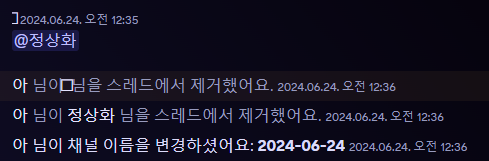

## 디스코드 스레드 자동 강퇴 봇
갤러리 디스코드에서 사용하기 위해 간단하게 제작한 스레드에서 안나가는 음침 으흐흐들을 내보내기 위한 코드입니다.

##
스레드의 마지막 채팅을 기준으로 새로운 채팅이 올라오지 않으면 4시간 뒤 자동으로 내보내는 작업을 합니다. <!-- (기존 : 스레드의 첫 채팅 / 6월 24일에 마지막 채팅으로 변경 -->

내보내는 작업이 완료되면 스레드의 제목을 스레드 생성 날짜로 변경합니다. 스레드에 남아있는 인원이 없다면 내보내는 작업은 실행되지 않고 바로 스레드의 제목을 변경합니다.

사용 시 PRESENCE INTENT, SERVER MEMBERS INTENT 권한을 켜야합니다.

## Note
스레드 채팅을 로깅하는 코드를 작성 해놨는데..! 시간이 없어서 테스트는 제대로 안해봤어요...
